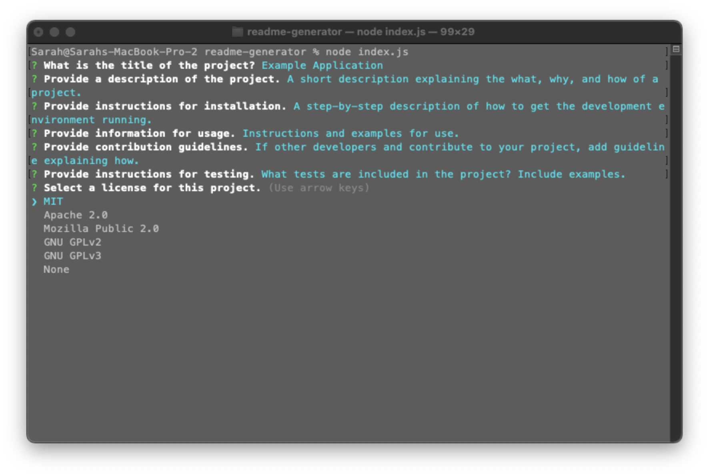
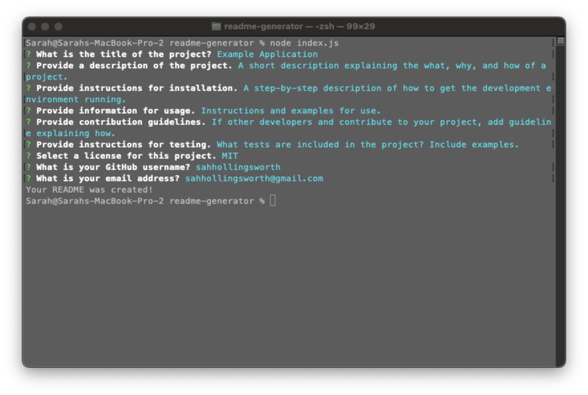
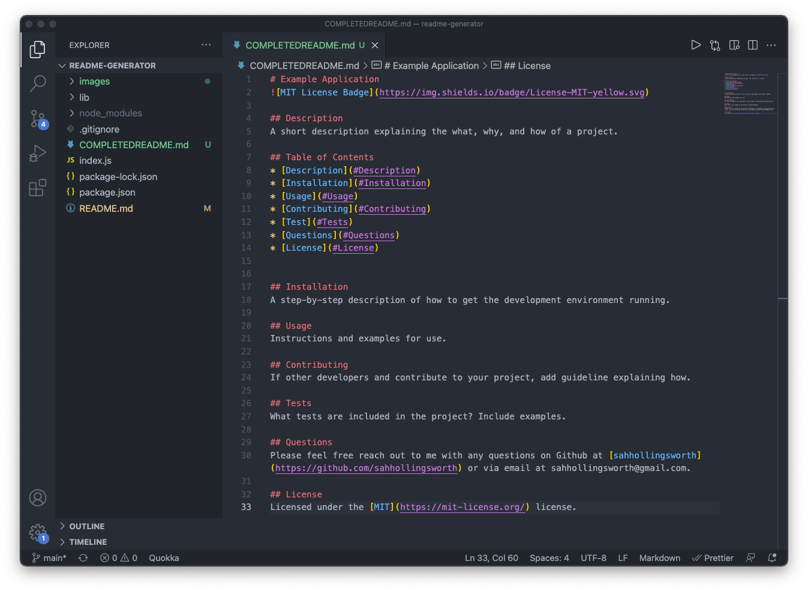
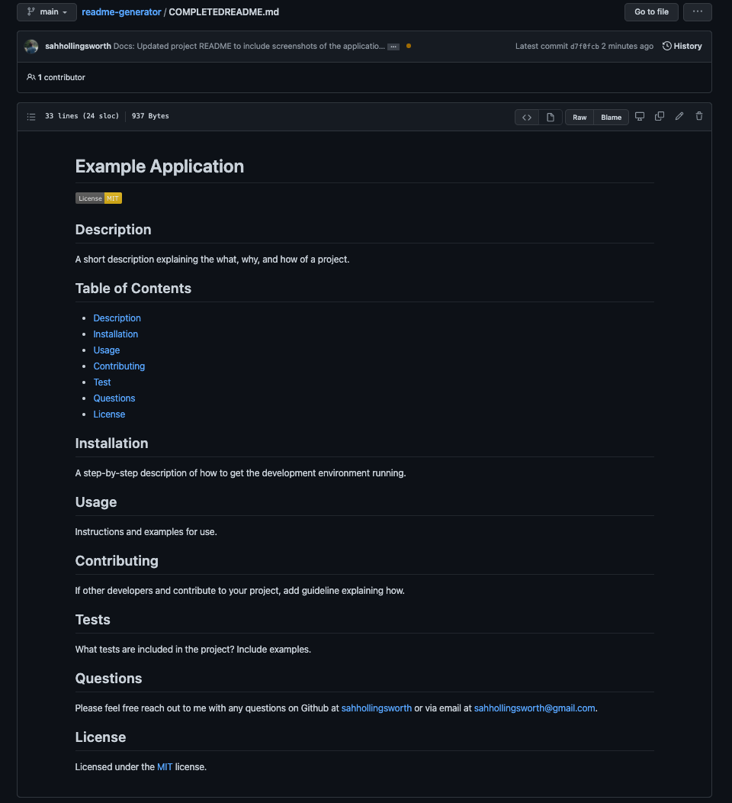

# README Generator
The README Generator is a command line application to create README's based on user input. The ability to quickly generate a pre-formatted README via command line allows developers to focus more time on application code.

## Application

### Command Line Interface
Command line interface - Mid-prompt question set.

Command line interface - Questions completed, README file generated successfully.

### README.md Output
README.md file code created from user input

README.md file created from user input on GitHub

## Summary
* From user input into the command line interface, a high-quality, professional [README.md](http://readme.md/) is generated with the title of the project and sections entitled Description, Table of Contents, Installation, Usage, License, Contributing, Tests, and Questions.
* User can enter their project title which will be displayed as the title of the README.
* User can enter description, installation instructions, usage information, contribution guidelines, and test instructions. This information is then added to the sections of the README entitled Description, Installation, Usage, Contributing, and Tests.
* THe user can select a license for their application from a list of options, resulting in:
  * A badge for that license is added near the top of the README.
  * A notice is added to the section of the README entitled License that explains which license the application is covered under.
* When the user enters their GitHub username, it is added to the section of the README entitled Questions, with a link to their GitHub profile.
* When the user enters their GitHub username, it is added to the section of the README entitled Questions, with instructions on how to reach them with additional questions.
* The Table of Contents has clickable links for each section that navigate user to the corresponding section of the README when clicked.

## Installation
Ensure you have Node.js installed locally to install packages to and from the public npm registry. [Node.js installation documentation.](https://docs.npmjs.com/downloading-and-installing-node-js-and-npm)

This project requires NPMjs and the Inquirer.js package. You can install both from the root folder in your local repo using command line as follows:
1. `npm init -y`
2. `npm install inquirer`

## Usage
Run this application by
1. Cloning the repository to your local machine.
2. Once in the root folder in your command line interface, start the application by entering `node index.js`

## Built with
* [Inquirer.js](https://www.npmjs.com/package/inquirer) - Package for common interactive command line user interfaces. 
* [NPM](https://www.npmjs.com/) - Node package manager, used in conjunction with JS and Inquirer to support application logic and Command Line interface.
* [Javascript](https://developer.mozilla.org/en-US/docs/Web/javascript)
* [Git](https://git-scm.com/doc) - Version control system to track changes to source code
* [GitHub](https://docs.github.com/en) - Hosts the code repository

## Authors
Sarah Hollingsworth
* [Github](https://github.com/sahhollingsworth)
* [LinkedIn](https://www.linkedin.com/in/sarahhollingsworth/)

## Acknowledgments
* Visual Studio Code repository's [README.md](https://github.com/microsoft/vscode) was used as a reference for the structure and content of the README.md file produced by this application.